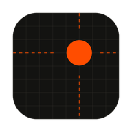
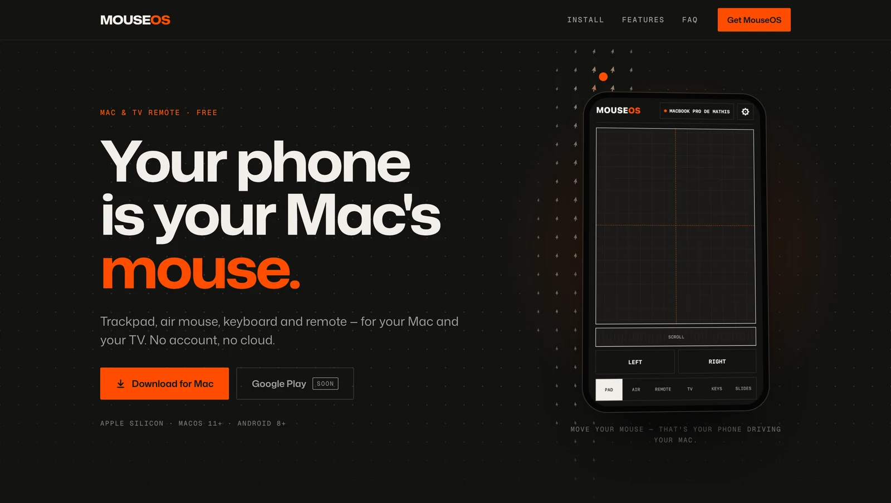
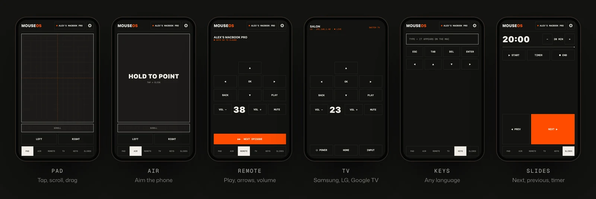
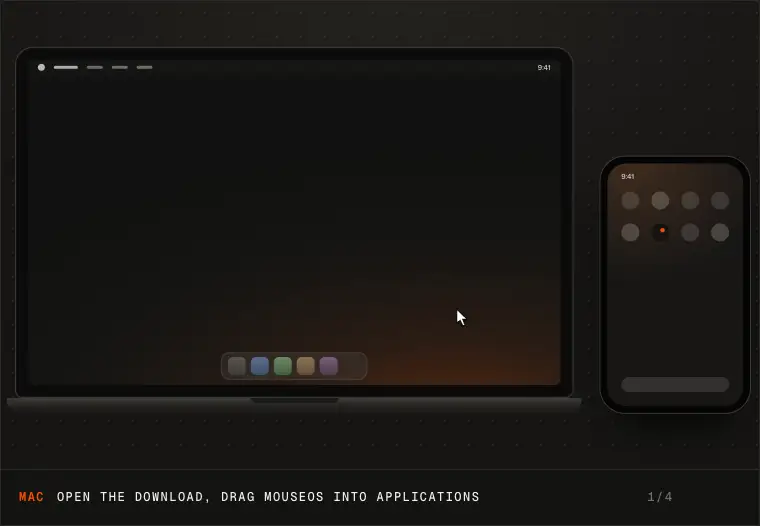
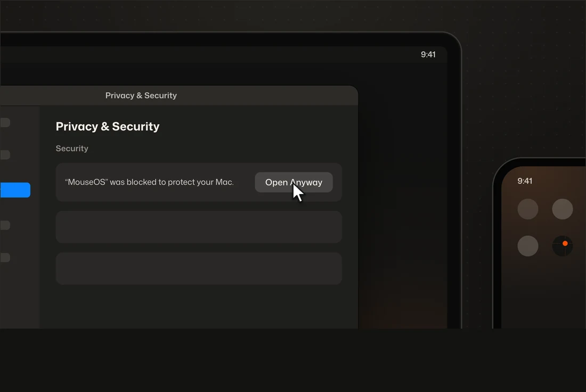
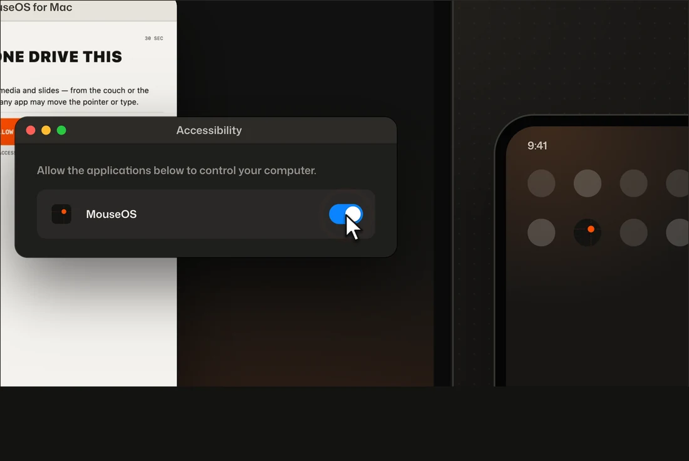
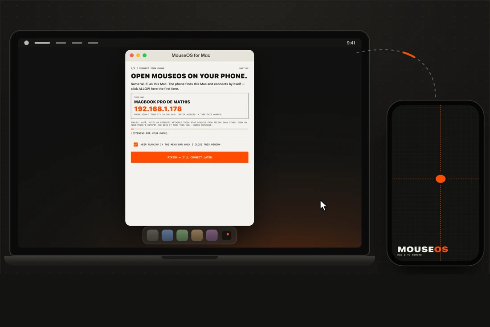
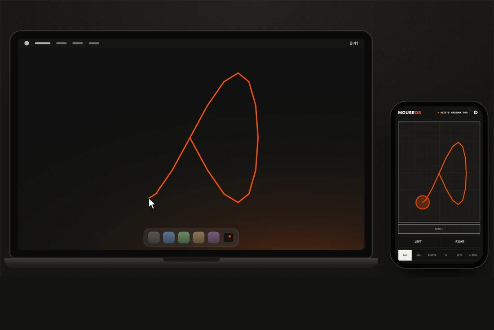

  

<h1 align="center">MouseOS</h1>

  <b>Your phone is your computer's mouse.</b> 
  Trackpad, air mouse, keyboard and remote — for your Mac, Windows PC, Linux computer and your TV. 
  Free. No account, no cloud.

  
  
  
  

  
  
  
  
  
  
  
  

## Six screens, one thumb

## Works with

| Computers | TVs | Phones |
|---|---|---|
| **Mac** — Apple silicon, macOS 11+ ([.dmg](https://github.com/MathisZerbib/mouseos/releases/latest)) | **Samsung** | **Android** 8+ (Google Play, soon) |
| **Windows** — 10 & 11, 64‑bit ([.msi](https://github.com/MathisZerbib/mouseos/releases/latest)) | **LG** | **iPhone** — on the way |
| **Linux** — 64‑bit, X11 or Wayland ([.deb / .rpm](https://github.com/MathisZerbib/mouseos/releases/latest)) | **Google TV** (Sony, TCL, Philips…) | |

## Install — two minutes, once

Start on your computer, finish on your phone. Keep both on the same Wi‑Fi. The pictures show a Mac; Windows and Linux are below.

<table>
  <tr>
    <td width="50%"></td>
    <td width="50%"></td>
  </tr>
  <tr>
    <td valign="top"><b>1 · On your Mac — download and open</b> <a href="https://github.com/MathisZerbib/mouseos/releases/latest">Download MouseOS for Mac</a>, drag it into <b>Applications</b>, open it. The first time, macOS stops it: <b>System Settings → Privacy &amp; Security → Open Anyway</b>.</td>
    <td valign="top"><b>2 · On your Mac — allow control</b> Click <b>ALLOW CONTROL</b>, then switch <b>MouseOS</b> on. macOS asks once before any app can move the pointer.</td>
  </tr>
  <tr>
    <td width="50%"></td>
    <td width="50%"></td>
  </tr>
  <tr>
    <td valign="top"><b>3 · On your phone — open MouseOS</b> Install it on your Android phone (Google Play, soon) and open it on the same Wi‑Fi. It finds your Mac by itself.</td>
    <td valign="top"><b>4 · Back on your Mac — click ALLOW</b> Once per phone. That's it: your phone is the mouse.</td>
  </tr>
</table>

**On Windows** — run the `.msi` (no admin rights needed). If Windows says it protected your PC: **More info → Run anyway**. The first time MouseOS opens, allow network access, and make sure your Wi‑Fi is a **Private** network. Then steps 3 and 4.

**On Linux** — install the `.deb` (Ubuntu, Debian, Mint) or the `.rpm` (Fedora, openSUSE). On Wayland, click **ALLOW CONTROL** in MouseOS and type your password once; on X11 there's nothing to do. Then steps 3 and 4.

## Private by design

- **No account, no cloud, no tracking.** Phone and Mac talk directly over your Wi‑Fi.
- **Nobody else takes over your computer.** Every new phone needs one ALLOW click on the computer.
- [Privacy policy](https://mathiszerbib.github.io/mouseos/privacy-policy.html)

## Stuck?

- **macOS won't open it** — System Settings → Privacy & Security, scroll down, **Open Anyway**. Only the first time: MouseOS isn't notarized yet.
- **Windows says it protected your PC** — **More info → Run anyway**. Only the first time: MouseOS isn't signed by Microsoft yet.
- **The phone doesn't find the computer** — same Wi‑Fi, VPN off. Café or hotel Wi‑Fi hides devices from each other: turn on your phone's hotspot and join it from the computer, or tap **TYPE THE ADDRESS** on the phone. On Windows, your Wi‑Fi must be a Private network.
- **The pointer doesn't move** — Mac: System Settings → Privacy & Security → Accessibility: switch MouseOS on. Linux on Wayland: open MouseOS and click **ALLOW CONTROL**.

---

This repository hosts the MouseOS website (<a href="https://mathiszerbib.github.io/mouseos/">mathiszerbib.github.io/mouseos</a>) and the releases for Mac, Windows and Linux.
